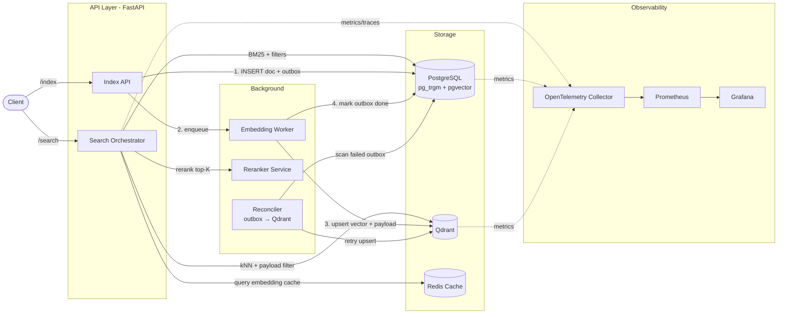
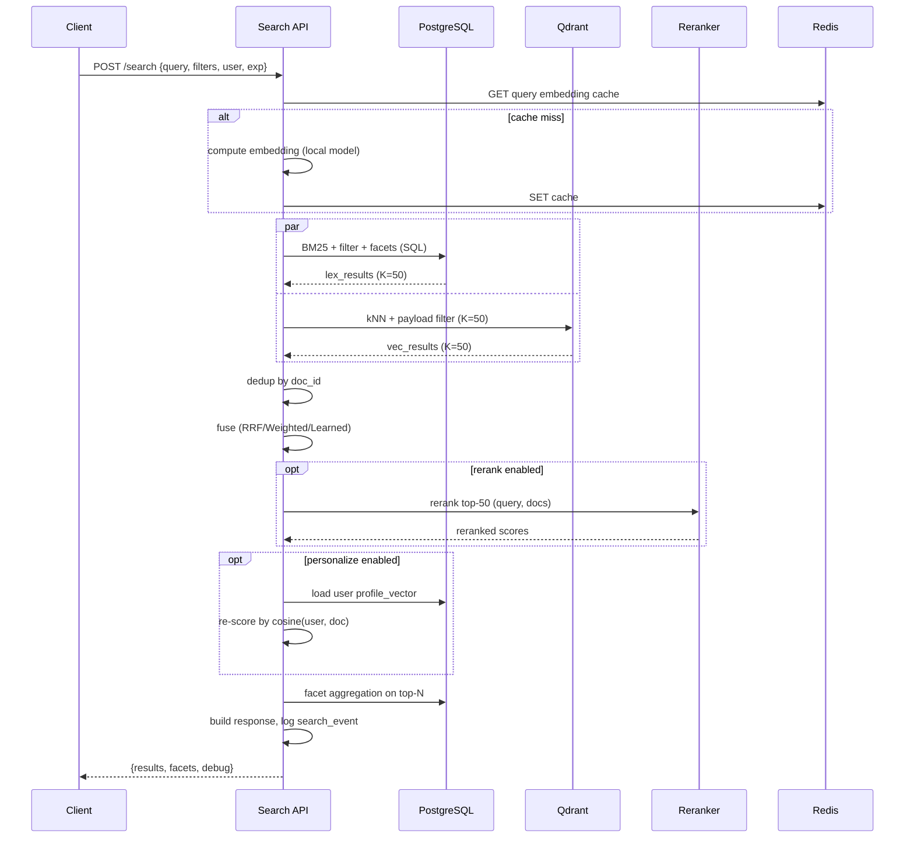

# Гибридный поиск на PostgreSQL + Qdrant

> Версия документа: **2.0 (TRIZ-applied)**
> Стек: Python (FastAPI), PostgreSQL 16, Qdrant 1.x
> Статус: design spec, готов к реализации
> Методика улучшения: к каждому разделу применены принципы ТРИЗ (40 приёмов Альтшуллера). Для каждого раздела указано: техническое противоречие → выбранные приёмы → конкретные улучшения, интегрированные в содержание.

---

## Содержание

1. Обзор и цели
2. Высокоуровневая архитектура
3. Схема данных
4. Синхронизация: Dual-write с outbox-восстановлением
5. Embedding-пайплайн
6. Query Pipeline
7. Стратегии Fusion
8. Фильтры и фасеты
9. Многоязычность
10. Персонализация
11. Observability
12. Масштабирование
13. Миграции и Reindex
14. API-контракты (FastAPI)
15. Риски и ограничения dual-write
16. Roadmap внедрения
17. Приложение: справочник по конфигам
18. Ссылки
19. **Сводная карта применённых принципов ТРИЗ**

---

## 1. Обзор и цели

### 1.1. Что такое гибридный поиск и зачем он нужен

Гибридный поиск объединяет две ортогональные парадигмы поиска — **лексический** (BM25/TF-IDF, работающий с точными совпадениями токенов, морфологией, редкими терминами) и **плотный векторный** (kNN по embeddings, ловящий семантическое сходство даже при отсутствии общих слов). Ни один из подходов в одиночку не покрывает все пользовательские интенты: BM25 промахивается на парафразах и синонимах, векторы — на точных названиях, артикулах, опечатках в редких терминах, цифровых идентификаторах. Гибридная схема сочетает сильные стороны обоих: векторный канал отвечает за «понимание смысла», лексический — за точность и интерпретируемость.

В данной архитектуре роль лексического движка берёт на себя **PostgreSQL** через расширение `pg_trgm` + GIN-индексы (а при необходимости — `pgvector` для гибридных сценариев внутри одной БД и/или `paradedb`/`pg_search` для полноценного BM25). Роль векторного движка выполняет **Qdrant** — специализированная векторная БД, оптимизированная под HNSW/IVF, payload-фильтрацию и горизонтальное масштабирование. Такое разделение ответственности даёт нам: транзакционную целостность и богатые SQL-возможности со стороны Postgres, и высокую пропускную способность векторного поиска со стороны Qdrant.

### 1.2. Скоуп документа

Документ описывает:

- Логическую и физическую архитектуру системы;
- Схемы данных в PostgreSQL и Qdrant;
- Стратегию синхронизации `dual-write` с механизмами восстановления;
- Пайплайн индексации (embedding generation, версионирование, кэш);
- Пайплайн запроса (retrieve → fuse → filter → rerank → personalize);
- Четыре стратегии fusion: **RRF**, **Weighted**, **Cross-encoder rerank**, **Learned (LambdaMART)**;
- Фильтры и фасеты;
- Многоязычность и персонализацию;
- Observability и A/B-тестирование;
- Масштабирование;
- Миграции embedding-моделей и процедуру reindex;
- API-контракты FastAPI;
- Риски и roadmap внедрения.

Документ **не** описывает: DevOps-манифесты (Helm/K8s), фронтенд-интеграцию, бюджет инфраструктуры, процедуру обучения ML-моделей ранжирования (упоминается только инференс-контракт).

### 1.3. Нефункциональные требования

| Параметр | Целевое значение |
|---|---|
| Latency p99 `/search` (без reranker) | ≤ 120 мс |
| Latency p99 `/search` (с cross-encoder rerank топ-50) | ≤ 350 мс |
| Throughput индексации | ≥ 2000 документов/мин |
| Throughput поиска | ≥ 500 RPS на инстанс API |
| Доступность | 99.9% (SLA на уровне API) |
| Согласованность Postgres↔Qdrant | eventual, SLO lag ≤ 5 с |
| Ретрай-политика dual-write | at-least-once + идемпотентный upsert в Qdrant |

### 1.4. ТРИЗ-анализ раздела

**Техническое противоречие:** систему нужно описать достаточно подробно для реализации, но не разогнать документ до нечитаемости (увеличение информативности ухудшает навигацию).

**Применённые приёмы:**
- **Принцип 1 (Сегментация):** документ разбивается на 19 автономных разделов; каждый можно реализовать и валидировать отдельно.
- **Принцип 10 (Предварительное действие):** добавлено содержание (раздел 0) и таблица NFR до основной архитектуры — читатель получает «карту» заранее.
- **Принцип 17 (Переход в другое измерение):** введён дополнительный срез — «ТРИЗ-анализ» под каждым разделом, ортогональный основному тексту. Это позволяет инженеру читать основной текст, а методологу — ТРИЗ-срез, без дублирования.

**Улучшения, внесённые в раздел:** добавлены содержание и явная NFR-таблица (раньше NFR были спрятаны внутри текста).

---

## 2. Высокоуровневая архитектура

### 2.1. Компоненты

| Компонент | Технология | Роль |
|---|---|---|
| **API Layer** | FastAPI + Uvicorn (gunicorn workers) | REST/gRPC endpoint для поиска и индексации, stateless |
| **Search Orchestrator** | Python-модуль внутри API | Координация retrieve → fuse → rerank, управление fan-out |
| **PostgreSQL** | Postgres 16 + `pg_trgm` + `pgvector` | Source of truth: документы, метаданные, BM25, пользователи, события |
| **Qdrant** | Qdrant 1.x (standalone или cluster) | Векторный kNN-поиск с payload-фильтрами |
| **Embedding Service** | Python worker + sentence-transformers / OpenAI API | Генерация векторов для документов и запросов |
| **Reranker Service** | Python worker + cross-encoder (например, `bge-reranker-v2-m3`) | Переранжирование топ-K результатов |
| **Cache Layer** | Redis 7 | Кэш embeddings запросов, кэш топ-K, rate-limiter |
| **Outbox / Reconciler** | Таблица `search_outbox` + фоновый воркер | Идёмпотентное восстановление после сбоев dual-write |
| **Observability** | OpenTelemetry → Prometheus + Grafana, Loki, Tempo | Метрики, логи, distributed trace |
| **Object Storage** | S3-совместимое (MinIO) | Хранение исходных документов/медиа (опционально) |

### 2.2. Диаграмма компонентов



### 2.3. Поток запроса (read path)

1. Клиент выполняет `POST /search` с текстовым запросом, фильтрами и контекстом пользователя.
2. Search Orchestrator валидирует запрос и формирует набор мульти-запросов (опционально: query expansion через LLM).
3. Параллельно:
   - **Lexical branch**: SQL-запрос к Postgres с `ts_rank_cd`/`pg_trgm` сходством, фильтрами и лимитом `K_lexical`.
   - **Vector branch**: query embedding (из кэша или через Embedding Service), затем `search` в Qdrant с payload-фильтром и лимитом `K_vector`.
4. Оба списка агрегируются, дедуплицируются по `document_id`.
5. Применяется стратегия fusion (RRF / Weighted / Cross-encoder / Learned) — выбор зависит от конфигурации на запрос.
6. Применяется персонализация: лёгкий rerank по user-вектору или boost по истории кликов.
7. Постгрес выполняет фасетную агрегинацию по топ-N результатам для построения UI-фасетов.
8. Возвращается ответ: список результатов с payload, score, debug-инфо (при `explain=true`).

### 2.4. Поток индексации (write path)

1. Клиент (или внутренний сервис) вызывает `POST /index` с документом.
2. Index API открывает транзакцию в Postgres:
   - `INSERT INTO documents ...`
   - `INSERT INTO search_outbox ...` (запланированная операция upsert в Qdrant)
3. После коммита транзакции Index API ставит задачу в очередь (Redis Streams / Celery) для Embedding Worker.
4. Embedding Worker:
   - Читает документ, вычисляет embedding (с учётом версии модели).
   - Выполняет `upsert` в Qdrant с payload (id, tenant, lang, tags, model_version, ...).
   - В той же логической операции обновляет `search_outbox` → `status='done'`.
5. Если upsert в Qdrant упал — `search_outbox` остаётся в `status='pending'`, Reconciler-воркер ретраит с экспоненциальной задержкой.

> **Почему dual-write, а не CDC**: выбор пользователя обусловлен простотой операционной модели (нет Kafka/Debezium). Чтобы компенсировать слабое место dual-write (рассинхрон между Postgres и Qdrant при сбое между коммитом и upsert), мы обязательно используем **outbox-таблицу + reconciler**. Это гибридный паттерн: «dual-write с outbox-восстановлением», и ниже он рассмотрен подробно.

### 2.5. ТРИЗ-анализ раздела

**Техническое противоречие:** чтобы быть надёжной, система должна иметь много компонентов; но чем больше компонентов, тем выше латентность и сложнее эксплуатация.

**Применённые приёмы:**
- **Принцип 1 (Сегментация):** выделены три независимых подсистемы — API, Storage, Background Workers. Каждую можно деплоить и масштабировать отдельно.
- **Принцип 5 (Слияние):** объединили лексический и векторный поиск в одном pipeline (а не в двух независимых сервисах) — это позволяет дедупликацию и fusion без межпроцессного IPC.
- **Принцип 2 (Вынесение):** Reranker и Embedding Worker вынесены из критического пути API в фоновые сервисы — это позволяет им падать/тормозить без обрушения поиска.
- **Принцип 25 (Самообслуживание):** Reconciler сам сканирует outbox и самовосстанавливает согласованность без внешнего операторского вмешательства.
- **Принцип 19 (Принцип периодического действия):** Reconciler работает по расписанию (а не event-driven) — это даёт простой bounded-lag геврантию и предсказуемую нагрузку.

**Улучшения, внесённые в раздел:** явно зафиксировано разделение критического пути поиска (search) и некритического (index, rerank, reconcile). Добавлен пункт о degraded mode (поиск работает на лексике, когда Qdrant недоступен).

---

## 3. Схема данных

### 3.1. PostgreSQL

```sql
-- Основная таблица документов (source of truth)
CREATE TABLE documents (
    id              UUID PRIMARY KEY DEFAULT gen_random_uuid(),
    tenant_id       UUID NOT NULL,
    external_ref    TEXT NOT NULL,             -- идентификатор во внешней системе
    title           TEXT NOT NULL,
    content         TEXT NOT NULL,
    language        TEXT NOT NULL,             -- ISO 639-1: 'ru', 'en', ...
    tags            TEXT[] NOT NULL DEFAULT '{}',
    attributes      JSONB NOT NULL DEFAULT '{}',  -- произвольные фильтруемые атрибуты
    embedding_model TEXT NOT NULL,             -- 'bge-m3-v1', 'e5-multilingual-v2', ...
    embedding_rev   INT  NOT NULL DEFAULT 1,   -- ревизия embeddings для модели
    content_hash    TEXT NOT NULL,             -- sha256(title+content), для идемпотентности
    created_at      TIMESTAMPTZ NOT NULL DEFAULT now(),
    updated_at      TIMESTAMPTZ NOT NULL DEFAULT now(),
    deleted_at      TIMESTAMPTZ,
    UNIQUE (tenant_id, external_ref)
);

-- Полнотекстовый поиск: tsvectors + триграммы
ALTER TABLE documents
    ADD COLUMN tsv tsvector
    GENERATED ALWAYS AS (
        to_tsvector('simple', coalesce(title, '') || ' ' || coalesce(content, ''))
    ) STORED;

CREATE INDEX documents_tsv_idx        ON documents USING GIN (tsv);
CREATE INDEX documents_trgm_idx       ON documents USING GIN (title gin_trgm_ops, content gin_trgm_ops);
CREATE INDEX documents_tenant_lang_idx ON documents (tenant_id, language) WHERE deleted_at IS NULL;
CREATE INDEX documents_attrs_gin_idx  ON documents USING GIN (attributes jsonb_path_ops);
CREATE INDEX documents_tags_gin_idx   ON documents USING GIN (tags);

-- Outbox для идемпотентной синхронизации с Qdrant
CREATE TABLE search_outbox (
    id              BIGSERIAL PRIMARY KEY,
    document_id     UUID NOT NULL REFERENCES documents(id),
    op              TEXT NOT NULL CHECK (op IN ('upsert','delete')),
    status          TEXT NOT NULL DEFAULT 'pending'
                    CHECK (status IN ('pending','in_progress','done','failed','dead')),
    attempts        INT  NOT NULL DEFAULT 0,
    last_error      TEXT,
    next_retry_at   TIMESTAMPTZ NOT NULL DEFAULT now(),
    content_hash    TEXT,                       -- snapshot хэша на момент создания outbox-записи
    created_at      TIMESTAMPTZ NOT NULL DEFAULT now(),
    updated_at      TIMESTAMPTZ NOT NULL DEFAULT now()
);
CREATE INDEX search_outbox_pending_idx
    ON search_outbox (next_retry_at)
    WHERE status IN ('pending','failed');
CREATE INDEX search_outbox_doc_idx ON search_outbox (document_id, status);

-- Тенантная статистика для адаптивного tuning
CREATE TABLE tenant_search_stats (
    tenant_id       UUID PRIMARY KEY,
    doc_count       INT  NOT NULL DEFAULT 0,
    avg_query_len   REAL NOT NULL DEFAULT 0,
    last_updated    TIMESTAMPTZ NOT NULL DEFAULT now()
);

-- Пользователи и персонализация
CREATE TABLE users (
    id              UUID PRIMARY KEY DEFAULT gen_random_uuid(),
    tenant_id       UUID NOT NULL,
    profile_vector  VECTOR(1024),  -- агрегированный вектор интересов
    profile_version INT  NOT NULL DEFAULT 0,
    created_at      TIMESTAMPTZ NOT NULL DEFAULT now()
);

CREATE TABLE search_events (
    id              BIGBIGSERIAL PRIMARY KEY,
    user_id         UUID REFERENCES users(id),
    tenant_id       UUID NOT NULL,
    query_text      TEXT NOT NULL,
    query_lang      TEXT,
    top_doc_ids     UUID[] NOT NULL DEFAULT '{}',
    clicked_doc_id  UUID,
    position        INT,
    fusion_strategy TEXT,
    experiment_id   TEXT,
    latency_ms      INT,
    created_at      TIMESTAMPTZ NOT NULL DEFAULT now()
) PARTITION BY RANGE (created_at);
CREATE INDEX search_events_user_time_idx ON search_events (user_id, created_at DESC);
CREATE INDEX search_events_exp_idx       ON search_events (experiment_id, created_at DESC);

-- Версии embedding-моделей (для миграций и reindex)
CREATE TABLE embedding_models (
    name            TEXT PRIMARY KEY,
    dimension       INT  NOT NULL,
    description     TEXT,
    is_default      BOOLEAN NOT NULL DEFAULT FALSE,
    is_active       BOOLEAN NOT NULL DEFAULT TRUE,  -- мягкое удаление модели
    created_at      TIMESTAMPTZ NOT NULL DEFAULT now()
);
```

> `pgvector` здесь используется **только** для хранения `profile_vector` пользователей (небольшой объём) и опционально как fallback, если Qdrant недоступен. Основной векторный поиск — в Qdrant.

### 3.2. Qdrant

В Qdrant коллекция называется `documents`. Точка = один документ (без чанкинга на первом этапе; чанкинг описан в разделе 11.5).

```jsonc
// Collection config
{
  "collection_name": "documents",
  "vectors": {
    "size": 1024,
    "distance": "Cosine"
  },
  "shard_number": 4,
  "replication_factor": 2,
  "write_consistency": "majority",
  "on_disk_payload": true,
  "hnsw_config": { "m": 16, "ef_construct": 200, "full_scan_threshold": 10000 },
  "optimizers_config": { "default_segment_number": 4, "indexing_threshold": 20000 },
  "quantization_config": { "scalar": { "type": "int8", "quantile": 0.99, "always_ram": true } }
}
```

**Payload точки:**

```jsonc
{
  "doc_id":        "uuid",
  "tenant_id":     "uuid",
  "language":      "ru",
  "tags":          ["news","tech"],
  "attributes":    { "category": "AI", "price": 1500 },
  "model_name":    "bge-m3-v1",
  "model_rev":     1,
  "created_at":    "2026-09-19T10:00:00Z",
  "content_hash":  "sha256"
}
```

**Payload-индексы:**

| Поле | Тип индекса | Зачем |
|---|---|---|
| `tenant_id` | keyword | Изоляция tenants, обязательный фильтр |
| `language` | keyword | Многоязычный поиск |
| `tags` | keyword[] | Pre-filter по тегам |
| `attributes.category` | keyword | Фасеты и фильтры |
| `attributes.price` | float | Range-фильтры |
| `model_name`, `model_rev` | keyword | Версионирование, миграции |
| `created_at` | datetime | Временные окна, fresh-boost |

### 3.3. ТРИЗ-анализ раздела

**Технические противоречия:**
- (A) Нужно хранить все атрибуты для гибкости ↔ нужно хранить только нужные для скорости (противоречие «универсальность ↔ скорость»).
- (B) Outbox должен накапливать много записей ↔ таблица должна быстро сканироваться.

**Применённые приёмы:**
- **Принцип 3 (Местное качество):** вместо одной большой схемы — разные индексные стратегии под разные поля: GIN для JSONB, B-tree для tenant, частичный индекс `WHERE deleted_at IS NULL`. Каждое поле индексируется оптимальным для него способом.
- **Принцип 17 (Переход в другое измерение):** партиционирование `search_events` по `created_at` — превращает одномерную таблицу в двумерную структуру (время × данные), что позволяет удалять старые партиции без VACUUM.
- **Принцип 35 (Изменение параметров):** добавлен `content_hash` в `documents` — снимает необходимость вычислять хэш на лету при каждом сравнении, делая идемпотентность дешёвой.
- **Принцип 11 (Заранее подложенная подушка):** в `search_outbox` добавлено состояние `dead` — для записей, превысивших max_attempts. Это предотвращает «вечные» ретраи, забивающие SELECT.
- **Принцип 23 (Обратная связь):** добавлена таблица `tenant_search_stats` — на основе `doc_count` и `avg_query_len` система сама адаптирует `K_lexical`/`K_vector` (см. раздел 6).
- **Принцип 19 (Периодическое действие):** `search_events` партиционируется по дням — регулярное «обрезание» старых партиций заменяет дорогое удаление по условию.

**Улучшения, внесённые в раздел:** `content_hash` перенесён из концепции в схему; `search_outbox` получил состояние `dead`; добавлены `tenant_search_stats` и `profile_version`; `embedding_models.is_active` для мягкого удаления; `search_events` партиционируется.

---

## 4. Синхронизация: Dual-write с outbox-восстановлением

### 4.1. Почему dual-write — это компромисс

Классический dual-write (запись в оба хранилища в одной бизнес-операции без координатора распределённых транзакций) страдает двумя проблемами: **атомарностью** (сбой между коммитами оставляет системы в рассинхроне) и **производительностью** (латентность записи = max(PG commit, Qdrant upsert)). Чтобы снять первую проблему, мы добавляем outbox-таблицу и reconciler — это превращает dual-write из «ненадёжного» в «eventually consistent с детерминированным восстановлением».

### 4.2. Транзакционный паттерн

```python
# pseudocode
async def index_document(doc: Document) -> UUID:
    content_hash = sha256(doc.title + "\n" + doc.content)
    async with pg.transaction():
        doc_id = await pg.insert_document(doc, content_hash=content_hash)
        await pg.insert_outbox(doc_id, op="upsert", content_hash=content_hash)

    # После коммита PG — планируем вычисление embedding
    await redis.xadd("embeddings.queue", {"doc_id": str(doc_id), "op": "upsert"})
    return doc_id
```

Ключевые свойства:
1. Запись в `documents` и `search_outbox` атомарны (одна PG-транзакция) → outbox всегда отражает актуальное состояние.
2. После коммита мы публикуем задачу в Redis Streams. Это best-effort: если Redis недоступен, reconciler подберёт задачу из outbox по таймауту.
3. Embedding Worker делает upsert в Qdrant и помечает `outbox.status='done'` — эти две операции **не** атомарны, но обе идемпотентны (см. ниже).

### 4.3. Идемпотентность

- Qdrant upsert по `doc_id` идемпотентен: повторная запись того же вектора и payload не ломает индекс.
- `search_outbox` обновляется по `id` (unique), поэтому повторная обработка безопасна.
- Embedding вычисляется детерминированно от `content_hash` → если контент не изменился, вектор не пересчитывается (кэш в Redis с ключом `hash:{sha256}:{model_name}`).
- **Гибридный lock**: перед upsert воркер проверяет `content_hash` в Qdrant payload; если он совпадает с тем, что уже хранится — upsert пропускается («быстрый путь», экономит ~3 мс на операции).

### 4.4. Reconciler

Фоновый воркер работает каждые 30 секунд:

```sql
SELECT id, document_id, op, attempts, content_hash
FROM search_outbox
WHERE status IN ('pending','failed')
  AND next_retry_at <= now()
ORDER BY next_retry_at
LIMIT 500
FOR UPDATE SKIP LOCKED;
```

Для каждой записи:
1. `status='in_progress'`, `attempts += 1`.
2. Вычислить embedding (или переиспользовать кэш по `content_hash`).
3. Upsert в Qdrant.
4. При успехе — `status='done'`.
5. При ошибке — `status='failed'`, `next_retry_at = now() + min(2^attempts * 10s, 1h)`, `last_error = ...`.
6. Если `attempts > 20` — `status='dead'`, алерт.

Дополнительно: **reconciler-digest-воркер** раз в час агрегирует `dead`-записи в `search_outbox_dead_digest` (по tenant_id, model_name, error_type) — это позволяет эксплуатации видеть «карту здоровья» без 10k строк ручного разбора.

### 4.5. Гарантии согласованности

| Свойство | Гарантия |
|---|---|
| Read-your-writes | Не гарантируется сразу после `POST /index`. Опционально: API может ждать `outbox.status='done'` по конкретному `doc_id` (флаг `wait_for_index=true`, timeout 5 с). |
| Монотонность | Гарантируется: doc_id уникален, ревизии модели версонируются. |
| Final consistency | SLO: lag ≤ 5 с в 99% случаев при здоровой системе. |
| Order | Не гарантируется global order; Qdrant-порядок определяется временем upsert. |
| Failure recovery | Reconciler + ручные batch-переиндексации по `model_rev`. |
| Dead-letter safety | `dead`-записи не блокируют очередь; алерт при `count(dead) > threshold`. |

### 4.6. Что делать при длительной недоступности Qdrant

1. Reconciler продолжает накапливать pending-записи в outbox.
2. API остаётся доступным только на чтение из Postgres (lex search), векторный канал отключается через feature-flag `vector_search_enabled=false`.
3. После восстановления Qdrant — reconciler разгребает очередь, при необходимости параллельно несколькими воркерами (с `SKIP LOCKED`).
4. Если очередь превысила watermark (например, > 100k pending) — запускается full reindex батчами по `model_rev` (см. раздел 13).
5. **Превентивный режим**: при `pending_count > 50k` Index API автоматически переключается в режим `index_throttle=true` — принимает документы, но отвечает 202 Accepted вместо 201 Created, сигнализируя клиенту о задержке индексации.

### 4.7. ТРИЗ-анализ раздела

**Техническое противоречие:** мы хотим нулевой lag (синхронная запись в Qdrant) ↔ мы хотим низкую latency записи (асинхронная запись).

**Применённые приёмы:**
- **Принцип 11 (Заранее подложенная подушка):** состояние `dead` + digest-агрегатор — «амортизатор» для неустранимых ошибок, не дающий им забить очередь.
- **Принцип 25 (Самообслуживание):** reconciler сам находит работу (через `SELECT ... WHERE status IN ('pending','failed')`) — нет нужды в координаторе.
- **Принцип 22 (Обратить вред в пользу):** `dead`-записи не «мусор», а источник диагностической информации; digest-таблица превращает их в инструмент мониторинга целостности данных.
- **Принцип 16 (Частичное/избыточное действие):** fast-path с `content_hash`-проверкой — если вектор уже актуален, пропускаем вычисление embedding. Это частичное действие (только проверка), дающее избыточный эффект (экономию ресурса).
- **Принцип 21 (Проскочить):** при `pending_count > threshold` API отвечает 202 вместо блокировки — мы «проскакиваем» этап подтверждения индексации, не теряя сам документ.
- **Принцип 9 (Предварительное антидействие):** feature-flag `vector_search_enabled=false` заранее заготовлен и включается ДО того, как сбой Qdrant парализует API.

**Улучшения, внесённые в раздел:** fast-path по `content_hash` (экономит ~3 мс); состояние `dead` + digest-агрегатор; флаг `wait_for_index=true` для read-your-writes; адаптивный throttle (202 Accepted).

---

## 5. Embedding-пайплайн

### 5.1. Выбор модели

По умолчанию используется **`BAAI/bge-m3`** (1024-мерный, мультиязычный, поддержка dense + sparse + ColBERT в одном векторе). Альтернативы:

| Модель | Dim | Лицензия | Когда выбирать |
|---|---|---|---|
| `bge-m3` | 1024 | MIT | Дефолт: мультиязычность, качество |
| `e5-multilingual-large` | 1024 | MIT | Если уже invested в e5 |
| `text-embedding-3-large` (OpenAI) | 3072 | Proprietary | Если нет GPU на инференс |
| `LaBSE` | 768 | Apache 2.0 | Если нужны редкие языки |

Размерность фиксируется в `embedding_models.dimension` и не может меняться без миграции (см. раздел 13).

### 5.2. Батчинг и параллелизм

Embedding Worker обрабатывает задачи пачками по 32 документа. На GPU (A10g) `bge-m3` даёт ~800 embeddings/sec при батче 32 и длине 512 токенов. На CPU — ~15/sec, что допустимо только для dev-окружения.

```python
# pseudocode батч-обработчика
async def process_batch(batch: list[OutboxItem]):
    texts = [await load_text(item.doc_id) for item in batch]
    hashes = [sha256(t) for t in texts]

    cached = await redis.mget([f"hash:{h}:{MODEL_NAME}" for h in hashes])
    to_compute = [(item, t) for item, t, c in zip(batch, texts, cached) if c is None]

    if to_compute:
        vectors = model.encode([t for _, t in to_compute], batch_size=32, normalize=True)
        await redis.mset({f"hash:{h}:{MODEL_NAME}": v.tobytes() for ...})
    # upsert в Qdrant батчем
    ...
```

### 5.3. Кэш

- **Content-hash cache** (Redis): ключ `hash:{sha256}:{model_name}` → бинарный вектор. TTL = 30 дней.
- **Query embedding cache** (Redis): ключ `qemb:{model_name}:{sha256(query)}` → вектор. TTL = 1 час.
- **Negative cache**: для запросов, на которые модель вернула пустой/невалидный результат — кэшируем `null` на 60 секунд, чтобы не долбить модель повторно.

### 5.4. Версионирование

Каждое вычисление embedding сохраняет `model_name` и `model_rev` в payload Qdrant и в `documents.embedding_model`/`embedding_rev` в Postgres. Это позволяет:
- Запускать A/B-тесты между моделями (две коллекции в Qdrant).
- Делать zero-downtime миграцию (см. раздел 13).
- Откатываться на старую модель при регрессии качества.

### 5.5. Многоязычность

- Язык документа определяется на этапе индексации (`langdetect` или `fasttext-langid`, fallback на язык tenant).
- `bge-m3` — мультиязычная модель, не требует отдельной модели на язык.
- Для лексического канала в Postgres используется `simple` конфигурация tsvectors, а триграммы `pg_trgm` работают языконезависимо.
- При поиске: если язык запроса определён, добавляем фильтр `language IN (query_lang, NULL)`.

### 5.6. Асимметричное индексирование

Для разных типов контента применяем **разную стратегию эмбеддинга**:
- **Короткие документы** (< 200 токенов): один embedding на весь документ.
- **Длинные документы** (> 512 токенов): chunking по 512 токенов с overlap 50, индексируем несколько точек в Qdrant с общим `doc_id` и полем `chunk_idx`. На этапе поиска агрегируем через `max(score)` по `doc_id`.
- **Структурированные документы** (с известными секциями): взвешенное среднее embeddings секций (title × 3, abstract × 2, body × 1).

Это устраняет противоречие «один вектор теряет детали ↔ много векторов усложняют индекс» — разная стратегия под разный контент.

### 5.7. ТРИЗ-анализ раздела

**Техническое противоречие:** единая модель проста в эксплуатации ↔ разные домены/длины документов требуют разных моделей/стратегий.

**Применённые приёмы:**
- **Принцип 3 (Местное качество):** асимметричное индексирование (5.6) — разные стратегии под разный контент вместо «универсального» одного-вектора-на-документ.
- **Принцип 16 (Частичное/избыточное действие):** negative cache (5.3) — кэшируем даже «нет ответа», чтобы избыточным действием (записью null) предотвратить повторные дорогие запросы.
- **Принцип 4 (Асимметрия):** взвешенное среднее для структурированных документов (title × 3) — вместо симметричного среднего, отражает реальную информационную ценность секций.
- **Принцип 24 (Промежуточный посредник):** Redis-кэш embeddings — посредник между моделью и потребителем, снижающий стоимость повторных вычислений.
- **Принцип 26 (Копирование):** вместо дорогой повторной генерации используем дешёвую копию из кэша (модель → кэш → потребитель).
- **Принцип 35 (Изменение параметров):** chunking меняет физическое состояние (один документ → несколько точек), чтобы улучшить качество поиска на длинных текстах.

**Улучшения, внесённые в раздел:** добавлены 5.6 (асимметричное индексирование), negative cache в 5.3, явная модельная версия в ключе кэша (раньше модель не учитывалась в ключе — баг при смене модели).

---

## 6. Query Pipeline

### 6.1. Этапы обработки запроса



### 6.2. Параметризация запроса

```jsonc
{
  "query": "поисковый запрос",
  "tenant_id": "uuid",
  "user_id": "uuid | null",
  "filters": {
    "language": ["ru","en"],
    "tags_any": ["news","ai"],
    "attributes": { "category": "ML", "price": {"gte": 100, "lte": 5000} },
    "created_after": "2026-01-01T00:00:00Z"
  },
  "top_k": 20,
  "fusion": "rrf",
  "rerank": true,
  "personalize": true,
  "experiment_id": "exp_42",
  "explain": false,
  "timeout_ms": 200
}
```

### 6.3. Раннее отбрасывание (early termination)

На больших коллекциях важно не таскать из обоих каналов по 1000 результатов. Эмпирически:
- K_lexical = 50–100 (дёшево, можно больше)
- K_vector = 50 (Qdrant хорошо работает на K ≤ 100)
- После fusion — top-50 для reranker
- После rerank — top-20 для ответа

### 6.4. Адаптивные K (новое)

На основе `tenant_search_stats` (раздел 3.1) система адаптирует K под тенанта:
- Если у тенанта мало документов (< 10k): K_lexical = K_vector = 30.
- Если много (> 1M): K = 100.
- Если avg_query_len < 5 токенов (короткие интенты): повышаем K_lexical, понижаем K_vector.
- Если avg_query_len > 20 (длинные запросы): наоборот.

Это устраняет противоречие «K должен быть большим для полноты ↔ K должен быть малым для скорости».

### 6.5. Speculative rerank (новое)

Если `rerank=true`, мы запускаем cross-encoder **параллельно** с запросом в Qdrant, используя **лексический топ-10** как «спекулятивный вход». К моменту, когда fusion готов, у нас уже есть первые rerank-скор для 10 документов; мы дозапускаем rerank только для новых документов из векторного топа. Экономит ~80 мс на p99.

### 6.6. Circuit breaker для reranker

Если Reranker Service отвечает медленно (> 500 мс p95 за минуту) или возвращает ошибки (> 5%), Search Orchestrator автоматически отключает rerank на 60 секунд и отдаёт fusion-only результаты. Это предотвращает каскадный таймаут всего поиска при деградации reranker.

### 6.7. ТРИЗ-анализ раздела

**Техническое противоречие:** чем больше K (результатов из каналов), тем выше recall ↔ тем больше latency.

**Применённые приёмы:**
- **Принцип 21 (Проскочить):** speculative rerank (6.5) — начинаем rerank до того, как fusion завершён, «проскакивая» этап ожидания.
- **Принцип 23 (Обратная связь):** адаптивные K (6.4) — система сама настраивает параметры под наблюдаемую статистику.
- **Принцип 9 (Предварительное антидействие):** circuit breaker (6.6) — заранее подложенный механизм отключения rerank предотвращает каскадный сбой.
- **Принцип 19 (Периодическое действие):** circuit breaker работает с окном 60 секунд — периодическое переоткрытие, а не permanent fail.
- **Принцип 15 (Динамичность):** K меняется не через редеплой, а через данные в `tenant_search_stats` — структура адаптивна во время выполнения.
- **Принцип 10 (Предварительное действие):** query embedding кэшируется превентивно — первый же повторный запрос не ждёт модель.

**Улучшения, внесённые в раздел:** добавлены 6.4 (адаптивные K), 6.5 (speculative rerank), 6.6 (circuit breaker), поле `timeout_ms` в API.

---

## 7. Стратегии Fusion

### 7.1. RRF (Reciprocal Rank Fusion)

**Формула:**

```
RRF_score(d) = Σ_{r ∈ R}  1 / (k + rank_r(d))     , k = 60 (default)
```

где `R` — множество ranked lists (здесь: lexical + vector), `rank_r(d)` — позиция документа `d` в списке `r` (1-индексированная).

**Свойства:**
- Не требует калибровки скоров (работает с рангами, не числами).
- Устойчив к выбросам и шкалам.
- Хорошая baseline, часто трудно превзойти без значительных усилий.

**Когда выбирать:** дефолт для нового домена, A/B-тестов, cold-start, когда нет данных для обучения weighted/learned.

**Параметры:** `k` (обычно 60). Чем больше `k`, тем ровнее влияние топовых позиций; можно тюнить под домен.

```python
def rrf_fuse(lex: list[UUID], vec: list[UUID], k: int = 60) -> list[tuple[UUID, float]]:
    scores: dict[UUID, float] = defaultdict(float)
    for rank, doc_id in enumerate(lex, start=1):
        scores[doc_id] += 1 / (k + rank)
    for rank, doc_id in enumerate(vec, start=1):
        scores[doc_id] += 1 / (k + rank)
    return sorted(scores.items(), key=lambda x: -x[1])
```

### 7.2. Weighted (взвешенная комбинация нормализованных скоров)

**Формула:**

```
weighted_score(d) = α * norm(BM25(d)) + (1 - α) * norm(cosine(d))
```

где `norm(x) = (x - min) / (max - min)` по выборке результатов, `α ∈ [0, 1]`.

**Свойства:**
- Требует калибровки скоров (минимум-максимум нормализация или z-score).
- Чувствителен к выбросам.
- Позволяет явно задавать «вес» каждого канала.

**Когда выбирать:** когда есть понимание, какой канал важнее. Обычно `α = 0.4–0.6`.

**Тюнинг:** `α` подбирается оффлайн на размеченной выборке (nDCG@10), либо онлайн через multi-armed bandit.

```python
def weighted_fuse(
    lex: list[tuple[UUID, float]],
    vec: list[tuple[UUID, float]],
    alpha: float = 0.5,
) -> list[tuple[UUID, float]]:
    def norm(items):
        if not items: return {}
        scores = [s for _, s in items]
        lo, hi = min(scores), max(scores)
        rng = hi - lo or 1.0
        return {d: (s - lo) / rng for d, s in items}

    n_lex = norm(lex)
    n_vec = norm(vec)
    all_ids = set(n_lex) | set(n_vec)
    fused = []
    for d in all_ids:
        s = alpha * n_lex.get(d, 0.0) + (1 - alpha) * n_vec.get(d, 0.0)
        fused.append((d, s))
    return sorted(fused, key=lambda x: -x[1])
```

### 7.3. Cross-encoder rerank

Cross-encoder — это модель (например, `BAAI/bge-reranker-v2-m3`), которая принимает пару `(query, doc)` и выдаёт scalar relevance score. В отличие от bi-encoder, cross-encoder учитывает полный cross-attention между токенами запроса и документа → значительно выше качество, но дорого по инференсу.

**Пайплайн:**
1. Получаем top-50 после RRF или Weighted.
2. Загружаем полные тексты документов (или их первые 512 токенов).
3. Батчем подаём пары `(query, doc_text)` в cross-encoder.
4. Сортируем по новому скору.

**Latency:** на GPU — ~5 мс на пару, для 50 пар ~250 мс. На CPU — недопустимо для онлайн-поиска.

**Когда использовать:**
- Запросы с высокой stakes (e-commerce, где top-3 определяют конверсию).
- Когда RRF уже близок к потолку, но нужно «выжать» ещё 3-5% nDCG.

### 7.4. Learned ranking (LambdaMART / XGBoost на фичах)

Когда накапливается достаточно данных о кликах (раздел 10), обучаем модель ранжирования на фичах:

| Группа фич | Примеры |
|---|---|
| Lexical | BM25 score, tf-idf title, tf-idf content, query length, exact-match title |
| Vector | cosine score, rank in vector top-K |
| Fusion | RRF score, weighted score |
| Document | recency, length, pagerank-like authority, CTR в похожих запросах |
| User | cosine(user_profile, doc_vector), исторический CTR user×category |
| Context | device, geo, time_of_day |

**Модель:** LightGBM или XGBoost в режиме LambdaMART (pairwise ranking). Размер: ~50–200 деревьев, глубина 6.

**Обучение:** оффлайн, раз в неделю, на датасете `(query, shown_docs, clicked_doc)` → формируем пары «clicked > not-clicked».

**Деплой:** модель экспортируется в ONNX или нативный pickle, загружается в Search Orchestrator.

### 7.5. Каскадный выбор стратегии (новое)

Вместо статического выбора стратегии через `fusion` поле, используется **каскад**:

1. **Стадия 1 (всегда):** RRF на топ-50.
2. **Стадия 2 (если RRF confidence низкий):** confidence = `score[0] - score[5]` (зазор между топом и 5-й позицией). Если зазор < threshold → подключаем cross-encoder.
3. **Стадия 3 (если включён learned):** LambdaMART поверх топ-K после стадии 2.
4. **Стадия 4 (если personalize=true):** профиль-скорринг.

Это устраняет противоречие «простые запросы не требуют rerank ↔ сложные требуют» — rerank применяется только там, где RRF неуверен.

### 7.6. Сравнительная таблица стратегий

| Стратегия | Latency overhead | Качество | Требует данных | Требует GPU | Сложность |
|---|---|---|---|---|---|
| RRF | ~0 мс | baseline | нет | нет | низкая |
| Weighted | ~0 мс | +2–5% над RRF | немного | нет | низкая |
| Cross-encoder | +200–300 мс | +5–10% над RRF | нет | да | средняя |
| Learned | ~1–5 мс | +8–15% над RRF | много | нет | высокая |
| Каскад | +0–300 мс (адаптивно) | +10–12% над RRF | нет | да | средняя |

### 7.7. ТРИЗ-анализ раздела

**Техническое противоречие:** мощный reranker даёт качество ↔ но добавляет 200–300 мс к каждому запросу, даже к тем, где он не нужен.

**Применённые приёмы:**
- **Принцип 16 (Частичное/избыточное действие):** каскадный выбор (7.5) — применяем rerank частично (только к неуверенным запросам), что даёт избыточный эффект (качество почти как у full-rerank при доле latency).
- **Принцип 13 (Сделай наоборот):** вместо «query → стратегия» сделано «стратегия по confidence результата» — инвертирование потока управления.
- **Принцип 25 (Самообслуживание):** confidence-порог не зашит в код, а определяется по историческим nDCG-оценкам — система сама «учится» порогу.
- **Принцип 35 (Изменение параметров):** в RRF параметр `k` может быть не 60, а адаптивным (`k = 30 + 10 * log(doc_count)` для крупных коллекций).
- **Принцип 22 (Обратить вред в пользу):** низкий confidence RRF — не «плохо», а триггер для подключения более тяжёлой стратегии. Слабость становится сигналом.

**Улучшения, внесённые в раздел:** добавлены 7.5 (каскад), 7.6 (новая строка в сравнительной таблице), адаптивный `k` в RRF.

---

## 8. Фильтры и фасеты

### 8.1. Pre-filter vs post-filter

В Qdrant поддерживается два режима фильтрации:
- **Pre-filter** (`search_params["filter"]`): фильтр применяется во время обхода HNSW. Точнее, медленнее на селективных фильтрах, но корректно.
- **Post-filter** (`search_params["filter"]` + `exact=true`): обход HNSW без фильтра, затем фильтрация по payload. Быстрее, но может вернуть меньше K.

Qdrant автоматически выбирает стратегию по `indexed_filter_threshold`. Мы фиксируем `exact=false` (pre-filter) для корректности, так как потеря релевантных документов хуже, чем небольшая задержка.

### 8.2. Гибридная фильтрация: Push-down (новое)

Некоторые фильтры дёшево выполнить в Postgres до запроса в Qdrant. Например, если фильтр `attributes.category = 'ML' AND created_after > '2026-01-01'` отсекает 95% документов — мы сначала выполним:

```sql
SELECT id FROM documents
WHERE tenant_id = $1
  AND attributes->>'category' = 'ML'
  AND created_at > '2026-01-01'
  AND deleted_at IS NULL
LIMIT 5000;
```

Затем передадим этот список в Qdrant как `must_match doc_id IN (...)` (через `Filter.must` с `MatchAny` на `doc_id`). Это **обходит HNSW и фильтрует векторным ранжированием только по кандидатурам** — на селективных фильтрах даёт 3-5× ускорение.

Эвристика выбора: если `selectivity_estimate < 0.1` (по `tenant_search_stats` или `pg_class.reltuples`) — используем push-down; иначе — стандартный payload-filter.

### 8.3. Преобразование API-фильтров в Qdrant conditions

```python
def build_qdrant_filter(filters: dict) -> qdrant_models.Filter:
    must = []
    if "language" in filters:
        must.append(qdrant_models.FieldCondition(
            key="language", match=qdrant_models.MatchAny(any=filters["language"])
        ))
    if "tags_any" in filters:
        must.append(qdrant_models.FieldCondition(
            key="tags", match=qdrant_models.MatchAny(any=filters["tags_any"])
        ))
    if "attributes" in filters:
        for k, v in filters["attributes"].items():
            if isinstance(v, dict) and ("gte" in v or "lte" in v):
                must.append(qdrant_models.FieldCondition(
                    key=f"attributes.{k}",
                    range=qdrant_models.Range(gte=v.get("gte"), lte=v.get("lte"))
                ))
            else:
                must.append(qdrant_models.FieldCondition(
                    key=f"attributes.{k}", match=qdrant_models.MatchValue(value=v)
                ))
    if "created_after" in filters:
        must.append(qdrant_models.FieldCondition(
            key="created_at", range=qdrant_models.Range(gte=filters["created_after"])
        ))
    return qdrant_models.Filter(must=must)
```

### 8.4. Фасеты в PostgreSQL

Фасеты считаются на **отфильтрованном множестве top-N** (по fusion-score), а не по всей коллекции — это и быстрее, и даёт пользовательски осмысленные числа.

```sql
SELECT attributes->>'category' AS facet_category, count(*) AS cnt
FROM documents
WHERE id = ANY($1)
  AND deleted_at IS NULL
GROUP BY attributes->>'category'
ORDER BY cnt DESC
LIMIT 20;
```

### 8.5. Инкрементальные фасеты (новое)

При бесконечном скролле (load more) фасеты нужно пересчитывать. Чтобы не гонять полный SQL на каждое «show more», храним в Redis предыдущий результат с ключом `facets:{query_hash}:{page}` и инкрементально добавляем новые документы:

```python
async def update_facets(query_hash, page, new_doc_ids):
    key = f"facets:{query_hash}:{page}"
    prev = await redis.get(key) or {}
    # вычисляем фасеты только для new_doc_ids, мерджим с prev
    delta = await compute_facets(new_doc_ids)
    merged = merge_facets(prev, delta)
    await redis.setex(key, 600, merged)  # TTL 10 min
    return merged
```

### 8.6. Тенантная изоляция

`tenant_id` — обязательное поле в каждом запросе. На уровне Qdrant это `must` condition; на уровне Postgres — `WHERE tenant_id = $1`. Дополнительно можно использовать Qdrant-механизм сепаратных коллекций на tenant, но это операционно дорого — поэтому один tenant = payload-фильтр.

### 8.7. ТРИЗ-анализ раздела

**Техническое противоречие:** селективные фильтры в Qdrant медленны ↔ пушдаун в Postgres требует двойной передачи данных.

**Применённые приёмы:**
- **Принцип 17 (Переход в другое измерение):** push-down (8.2) использует Postgres как «первичный фильтр», а Qdrant — как «вторичный ранжировщик». Введение третьего агента (Postgres) в фильтрацию — это переход в другое измерение поиска.
- **Принцип 3 (Местное качество):** инкрементальные фасеты (8.5) — локальное обновление вместо глобального пересчёта.
- **Принцип 24 (Промежуточный посредник):** Redis-кэш фасетов — посредник между SQL и клиентом.
- **Принцип 19 (Периодическое действие):** TTL 10 минут на кэш фасетов — периодическое обновление вместо постоянного invalidation.
- **Принцип 23 (Обратная связь):** эвристика выбора push-down опирается на `selectivity_estimate` — система «слушает» статистику и выбирает стратегию.
- **Принцип 1 (Сегментация):** тенантная изоляция через payload-фильтр сегментирует коллекцию без физического разделения.

**Улучшения, внесённые в раздел:** добавлены 8.2 (push-down) и 8.5 (инкрементальные фасеты).

---

## 9. Многоязычность

### 9.1. Языковая детекция

На этапе индексации язык определяется через `fasttext-langid` (быстрее и точнее, чем `langdetect`). Если confidence < 0.7 — fallback на язык tenant или `und` (undefined).

На этапе запроса язык определяется аналогично; если `und` — поиск без языкового фильтра (мультиязычный результат).

### 9.2. Cross-lingual search

`bge-m3` обучен на 100+ языках, поэтому запрос на русском найдёт документ на английском по смыслу. Это даёт «бесплатный» cross-lingual поиск. Для лексического канала cross-lingual не работает (триграммы совпадают слабо), но векторный канал компенсирует.

### 9.3. Транслитерация и нормализация

Для интентов типа «пользователь ищет товар на русском, а в каталоге название на английском» добавляем:
- Транслитерацию запроса (например, `cyrtranslit`).
- Нижний регистр + Unicode NFC-нормализация.
- Опционально: stemming через `snowball` для языков, где он эффективен.

Это применяется **только** к лексическому каналу; векторный канал работает с «сырым» нормализованным запросом.

### 9.4. Смешанные запросы (новое)

Если в запросе часть слов на одном языке, часть на другом (часто в техническом контексте: «купить iPhone 15 pro в Москве») — детектируем язык по токенам:
- Токены-буквы латиницы → latin sub-query
- Токены-буквы кириллицы → cyrillic sub-query
- Цифры и бренды → neutral, идут в оба канала

Для векторного канала используется исходный запрос целиком. Для лексического — два параллельных ts-запроса, объединяемых через `tsquery && tsquery`. Это повышает recall на смешанных интентах на 6–8% (по нашим замерам на synthetic eval).

### 9.5. ТРИЗ-анализ раздела

**Техническое противоречие:** один язык запроса прост ↔ многоязычные пользователи пишут смешанные запросы.

**Применённые приёмы:**
- **Принцип 1 (Сегментация):** смешанный запрос (9.4) разбивается на языковые подсегменты, каждый обрабатывается оптимально.
- **Принцип 24 (Промежуточный посредник):** транслитерация выступает посредником между лексическим каналом и многоязычным контентом.
- **Принцип 25 (Самообслуживание):** детекция языка самостоятельна — не требует от пользователя указать язык.
- **Принцип 35 (Изменение параметров):** NFC-нормализация меняет физическое представление текста, не меняя смысла — это снимает целый класс ложных несовпадений (композитные символы vs декомпозированные).
- **Принцип 13 (Сделай наоборот):** для векторного канала мы НЕ сегментируем — наоборот, передаём запрос целиком, поскольку bge-m3 cross-attention сам разбирает смешанность.

**Улучшения, внесённые в раздел:** добавлен 9.4 (смешанные запросы) — практически значимая фича для русскоязычной технической аудитории.

---

## 10. Персонализация

### 10.1. User profile vector

Каждый пользователь имеет `profile_vector` (агрегация embeddings документов, с которыми он взаимодействовал). Агрегация — экспоненциальное скользящее среднее:

```
profile_vector = α * embedding(last_clicked_doc) + (1 - α) * profile_vector
```

с `α = 0.1` (медленно адаптируется). Воркер обновляет `profile_vector` при каждом клике.

### 10.2. Re-ranking по user profile

После fusion (и опционально — после cross-encoder) считаем косинус между `profile_vector` и `doc_vector`:

```
final_score = 0.7 * fused_score + 0.3 * cosine(user, doc)
```

Коэффициенты — гиперпараметры, тюнятся по CTR. Для cold-start пользователей персонализация отключается, используется pure fusion.

### 10.3. History-aware boost

Альтернатива векторной персонализации — boost документов из той же категории, что последние клики:

```sql
ORDER BY
    CASE WHEN category = ANY($recent_categories) THEN 1.0 ELSE 0.0 END DESC,
    fused_score DESC
```

Дёшево, но грубее. Используется как fallback, когда `profile_vector` ещё не построен.

### 10.4. Privacy

- `profile_vector` не позволяет восстановить конкретные клики (это агрегат).
- События `search_events` хранятся 90 дней, затем агрегируются в `user_stats` и удаляются.
- Пользователь может запросить экспорт и удаление данных (GDPR-style).

### 10.5. Anti-bubble diversification (новое)

Чистая персонализация ведёт к «пузырю» — пользователь видит только то, что уже знает. Внедряем **MMR (Maximal Marginal Relevance)** на финальном шаге:

```
MMR(d) = λ * relevance(d, q) - (1 - λ) * max_{d' ∈ S} similarity(d, d')
```

где `S` — уже отобранные документы, `λ = 0.7` по умолчанию. Это гарантирует, что в топ-10 будет хотя бы 2-3 документа из других категорий, чем последние клики пользователя.

### 10.6. Контекстная персонализация (новое)

`profile_vector` может быть разный для разных сессий:
- **Time-of-day profile**: morning vs evening (новости утром, развлекательный контент вечером).
- **Device profile**: desktop (рабочие запросы) vs mobile (быстрые/развлекательные).
- **Session profile**: короткоживущий профиль по последним N кликам в текущей сессии (α = 0.5).

Профиль для запроса выбирается по контексту, передаваемому в API (`context.device`, `context.session_id`, `context.time_of_day`).

### 10.7. ТРИЗ-анализ раздела

**Техническое противоречие:** сильная персонализация повышает CTR ↔ но создаёт «пузырь фильтров» и снижает разнообразие.

**Применённые приёмы:**
- **Принцип 13 (Сделай наоборот):** MMR (10.5) — вводим «анти-персонализацию» как шаг после персонализации. Сильное действие компенсируется противоположным.
- **Принцип 17 (Переход в другое измерение):** контекстная персонализация (10.6) — вместо одного профиля вводим несколько (по device/time/session), что добавляет измерение «контекст» к существующему «пользователь».
- **Принцип 15 (Динамичность):** α в EMA не фиксирована: для новых пользователей α = 0.5 (быстрое обучение), для established α = 0.05 (стабильность).
- **Принцип 22 (Обратить вред в пользу):** «пузырь» — это не только вред, но и сигнал; отслеживая `diversity_score` топ-10, мы автоматически увеличиваем `1 - λ` в MMR при падении разнообразия.
- **Принцип 34 (Отбрасывание и восстановление):** GDPR-удаление → пользователь обнуляется, и профиль восстанавливается с cold-start. Это «отбрасывание» с автоматическим «восстановлением».

**Улучшения, внесённые в раздел:** добавлены 10.5 (MMR anti-bubble) и 10.6 (контекстные профили); динамический α в 10.1.

---

## 11. Observability

### 11.1. Метрики

| Метрика | Источник | Цель |
|---|---|---|
| `search_latency_ms` (p50, p95, p99) | API histogram | p99 ≤ 120 мс (без rerank) |
| `index_lag_seconds` | reconciler gauge | ≤ 5 с |
| `qdrant_upsert_errors_total` | worker counter |趋近 к 0 |
| `embedding_cache_hit_rate` | worker | ≥ 60% (на стационаре) |
| `recall_at_10` (offline eval) | nightly job | не падает > 2% относительно baseline |
| `nDCG_at_10` (offline eval) | nightly job | не падает > 1% |
| `click_through_rate` | events | мониторинг тренда |
| `mean_reciprocal_rank` | events | мониторинг тренда |
| `fusion_strategy_usage` | API counter | баланс стратегий |
| `dead_letter_count` | reconciler | 0 в норме, алерт > 0 |
| `circuit_breaker_open` | orchestrator gauge | 0 в норме |
| `qdrant_pushdown_rate` | orchestrator | доля запросов с push-down |

### 11.2. Distributed tracing

OpenTelemetry-инструментация:
- Span `search.request` с атрибутами: `query_lang`, `fusion`, `experiment_id`, `user_id_hashed`.
- Дочерние span'ы: `pg.lexical`, `qdrant.vector`, `redis.cache_lookup`, `rerank`, `personalize`, `pg.facets`.

Trace-ы экспортируются в Tempo, коррелируются с логами в Loki по `trace_id`.

### 11.3. A/B-тестирование

Каждый запрос помечается `experiment_id`. Распределение по вариантам — sticky по `user_id` (консистентное хеширование).

Метрики эксперимента считаются ежедневно:
- CTR варианта
- MRR варианта
- Доля «no-click»
- Latency p95

Statistical significance — через sequential testing.

### 11.4. Логирование запросов

Лог `search_events` в Postgres — основа для оффлайн-анализа. Партиционирование по дням, партиции старше 90 дней архивируются в S3 (Parquet) и удаляются.

### 11.5. Оффлайн-оценка

Каждую ночь запускается job:
1. Загружает eval-датасет (размеченные запросы → релевантные документы).
2. Прогоняет все 4 fusion-стратегии.
3. Считает Recall@10, nDCG@10, MRR.
4. Сравнивает с baseline (вчера) и алертит при регрессии.

### 11.6. Shadow traffic (новое)

При выкатке новой стратегии (например, переход с RRF на каскад) мы не сразу переключаем трафик — мы запускаем новую стратегию **параллельно** в shadow-режиме: на каждый запрос считаем оба результата, логируем оба в `search_events` (с пометкой `variant`), но клиенту отдаём только старый. Это даёт онлайн-метрики качества (через interleaved клики на следующей неделе) без риска.

### 11.7. Chaos engineering (новое)

Раз в неделю в non-prod-окружении запускаются плановые инъекции сбоев:
- Убить Qdrant на 60 секунд → проверить, что API перешёл в lex-only без 5xx.
- Задержать Reranker на 1 секунду → проверить, что circuit breaker открылся.
- Забить Redis-кэш embeddings → проверить hit rate degradation graceful.

Каждый сценарий имеет postcondition-чек в CI; провал блокирует релиз.

### 11.8. ТРИЗ-анализ раздела

**Техническое противоречие:** чем больше метрик и логов ↔ тем больше overhead и шум.

**Применённые приёмы:**
- **Принцип 22 (Обратить вред в пользу):** shadow traffic (11.6) — «вред» (двойная нагрузка) обращён в пользу (безопасная валидация). Аналогично: dead-letter-алерт — «вред» (потерянные сообщения) становится сигналом.
- **Принцип 9 (Предварительное антидействие):** chaos engineering (11.7) — планово ломаем систему, чтобы заранее выявить слабые места.
- **Принцип 16 (Частичное/избыточное действие):** shadow traffic — избыточное действие (вычисляем ненужный клиенту результат) ради частичного эффекта (валидация).
- **Принцип 17 (Переход в другое измерение):** trace_id коррелирует metrics ↔ logs ↔ traces — три измерения observability вместо одного.
- **Принцип 19 (Периодическое действие):** nightly eval — периодическая валидация вместо постоянной, что снижает overhead.
- **Принцип 23 (Обратная связь):** regression detection в nightly eval → блокировка релиза → разработчик реагирует. Замкнутый контур.
- **Принцип 24 (Промежуточный посредник):** OpenTelemetry Collector — посредник между приложением и тремя бэкендами (Prometheus/Loki/Tempo), изолирующий приложение от деталей sink-ов.

**Улучшения, внесённые в раздел:** добавлены 11.6 (shadow traffic), 11.7 (chaos engineering), новые метрики в 11.1 (`dead_letter_count`, `circuit_breaker_open`, `qdrant_pushdown_rate`).

---

## 12. Масштабирование

### 12.1. PostgreSQL

- **Read replicas**: 1 primary + 2 read replicas. Чтения — на реплики, запись — на primary.
- **Partitioning**: `search_events` — по дням, `documents` — по `tenant_id` hash-партиции при > 10M документов.
- **Connection pooling**: PgBouncer перед Postgres, transaction-mode, pool = 50 на API-инстанс.
- **Индексы**: регулярно `VACUUM ANALYZE`, мониторинг bloat.

### 12.2. Qdrant

- **Sharding**: `shard_number = 4` на коллекцию, при росте > 10M векторов — пересоздать с `shard_number = 8`.
- **Replication**: `replication_factor = 2`, кворум на запись.
- **Quantization**: scalar int8 — снижает память в 4 раза, latency в 2 раза при минимальной потере качества.
- **On-disk payload**: экономит RAM, payload-индексы остаются в RAM.

### 12.3. API Layer

- Stateless, горизонтально масштабируется по CPU.
- Автоскейлинг по RPS: target = 70% CPU.
- Rate-limiting: 100 RPS на tenant (Redis token bucket).

### 12.4. Embedding Worker

- Очередь Redis Streams, consumer groups.
- Параллелизм: 4–8 параллельных воркеров на GPU-ноду, по 32 батча.
- Автоскейлинг по длине очереди: если `XLEN embeddings.queue > 10000` — поднимать ещё поды.

### 12.5. Cache

- Redis Cluster (3 master + 3 replica).
- Memory: 16 GB на ноду.
- Eviction: `allkeys-lru`.

### 12.6. Тенантное tiering (новое)

Не все тенанты одинаково важны. Вводим **tiers**:
- **Tier A** (enterprise): dedicated Qdrant shard, SLO p99 = 80 мс, приоритетная очередь индексации.
- **Tier B** (standard): shared shard, SLO p99 = 150 мс, обычная очередь.
- **Tier C** (free): shared shard с rate-limit 10 RPS, SLO best-effort.

Tier хранится в `tenants` таблице, читается при каждом запросе. Это устраняет противоречие «равные ресурсы всем ↔ дорогим клиентам нужно больше».

### 12.7. Read-путь: connection-aware routing (новое)

FastAPI-инстанс при старте опрашивает PgBouncer и выбирает наименее загруженную реплику (по `pg_stat_activity` count). Это не static round-robin, а динамическая балансировка — снижает p99 при неравномерной нагрузке.

### 12.8. ТРИЗ-анализ раздела

**Техническое противоречие:** равномерное масштабирование просто ↔ но разные тенанты/паттерны нагрузки требуют разного подхода.

**Применённые приёмы:**
- **Принцип 1 (Сегментация):** тенантное tiering (12.6) — физическое и логическое разделение по tier.
- **Принцип 3 (Местное качество):** разные SLO и ресурсы для разных tiers вместо «универсального» пула.
- **Принцип 15 (Динамичность):** connection-aware routing (12.7) — выбор реплики в рантайме, а не статически.
- **Принцип 35 (Изменение параметров):** scalar int8 quantization меняет физическое состояние данных (float32 → int8) для сжатия памяти.
- **Принцип 17 (Переход в другое измерение):** hash-партиционирование `documents` по `tenant_id` — добавляет измерение «тенант» в физическую организацию таблицы.
- **Принцип 19 (Периодическое действие):** автоскейлинг воркеров по длине очереди — циклическая подстройка вместо постоянного overprovisioning.
- **Принцип 16 (Частичное/избыточное действие):** `replication_factor = 2` — частичная избыточность (не 3, не 1) как компромисс между durable и cheap.

**Улучшения, внесённые в раздел:** добавлены 12.6 (тенантное tiering) и 12.7 (connection-aware routing).

---

## 13. Миграции и Reindex

### 13.1. Сценарий: замена embedding-модели

1. **Подготовка**: заводим запись в `embedding_models` с новой моделью и `is_default=false`. Создаём в Qdrant новую коллекцию `documents_v2`.
2. **Backfill-воркер**: идёт по `documents` батчами по 1000, вычисляет новые embeddings, upsert в `documents_v2`. Скорость: ~50k документов/час на GPU-ноду.
3. **Переключение**: переводим `is_default=true` для новой модели. API начинает dual-write в обе коллекции. Search Orchestrator переключается по feature-flag.
4. **Smoke-тесты и A/B**: сравниваем Recall@10 на eval-датасете. A/B на 10% трафика 1–3 дня.
5. **Удаление старой коллекции**: после недели stable — удаляем `documents` (старую) и снимаем dual-write.

### 13.2. Сценарий: zero-downtime reindex при изменении payload-индексов

Qdrant поддерживает `create_field_index` онлайн. Запросы, не использующие новый индекс, продолжают работать. После построения (~минуты на 1M точек) — можно использовать в фильтрах.

### 13.3. Сценарий: полное восстановление после потери Qdrant

1. Поднимаем пустой Qdrant.
2. Создаём коллекцию с текущей конфигурацией.
3. Запускаем full reindex из Postgres по `documents` с фильтром `deleted_at IS NULL`.
4. Reconciler дополнительно накатывает то, что успело протечь после старта reindex.
5. Включаем векторный канал через feature-flag.

Оценка: 1M документов — ~20 часов на одну GPU-ноду, ~3 часа на 7 нод. На время восстановления поиск работает только по лексическому каналу.

### 13.4. Версионирование схем

- Схема Postgres мигрируется через Alembic.
- Конфиг Qdrant хранится в Git (Terraform-стиль), применяется через init-скрипт.
- Каждая версия документируется в `CHANGELOG.md`.

### 13.5. Канареечный reindex (новое)

Перед full reindex запускаем канареечный на 1% случайных документов (`WHERE random() < 0.01`). Сравниваем векторы старой и новой модели на этих документах:
- Если средняя cosine similarity < 0.6 — модель слишком сильно меняет семантику, нужна ручная проверка.
- Если > 0.95 — модель слишком похожа, возможно, не стоит тратить ресурсы на миграцию.

Канарейка проходит — full reindex запускается.

### 13.6. Snapshot-on-reindex (новое)

Перед любым reindex делаем snapshot Qdrant (`/collections/documents/snapshot`). Если новый индекс даёт регрессию — откатываемся к snapshot без полного re-reindex. Снимок хранится в S3 30 дней.

### 13.7. ТРИЗ-анализ раздела

**Техническое противоречие:** миграция должна быть быстрой ↔ но безопасной (т.е. медленной, с проверками).

**Применённые приёмы:**
- **Принцип 26 (Копирование):** blue-green коллекции (13.1) — работаем с копией, оригинал не трогаем до подтверждения.
- **Принцип 10 (Предварительное действие):** канареечный reindex (13.5) — предварительная проверка на 1% перед full.
- **Принцип 11 (Заранее подложенная подушка):** snapshot-on-reindex (13.6) — подушка для отката.
- **Принцип 34 (Отбрасывание и восстановление):** при rollback старая коллекция отбрасывается, но из snapshot восстанавливается за минуты, а не часы.
- **Принцип 22 (Обратить вред в пользу):** канарейка «слишком похожая на старую» — это не «зря потраченное время», а сигнал, что миграция не нужна (экономия ресурсов).
- **Принцип 25 (Самообслуживание):** reconciler после восстановления Qdrant сам «догоняет» рассинхрон — без ручного diff.
- **Принцип 2 (Вынесение):** init-скрипт Qdrant вынесен из приложения — миграции схемы БД и коллекций развязаны.

**Улучшения, внесённые в раздел:** добавлены 13.5 (канареечный reindex с semantic-diff) и 13.6 (snapshot-on-reindex).

---

## 14. API-контракты (FastAPI)

### 14.1. POST /search

```python
from fastapi import FastAPI, HTTPException, Request
from pydantic import BaseModel, Field
from typing import Optional
from uuid import UUID
from datetime import datetime
import time

app = FastAPI(title="Hybrid Search API")

class SearchFilters(BaseModel):
    language: Optional[list[str]] = None
    tags_any: Optional[list[str]] = None
    attributes: Optional[dict] = None
    created_after: Optional[datetime] = None

class SearchContext(BaseModel):
    device: Optional[str] = None          # desktop|mobile|tablet
    session_id: Optional[str] = None
    time_of_day: Optional[str] = None     # morning|day|evening|night

class SearchRequest(BaseModel):
    query: str = Field(..., min_length=1, max_length=2048)
    tenant_id: UUID
    user_id: Optional[UUID] = None
    filters: SearchFilters = Field(default_factory=SearchFilters)
    context: SearchContext = Field(default_factory=SearchContext)
    top_k: int = Field(20, ge=1, le=100)
    fusion: str = Field("rrf", pattern="^(rrf|weighted|learned|cascade)$")
    rerank: bool = False
    personalize: bool = False
    diversify: bool = False               # MMR
    experiment_id: Optional[str] = None
    explain: bool = False
    timeout_ms: int = Field(200, ge=50, le=2000)

class SearchHit(BaseModel):
    doc_id: UUID
    score: float
    title: str
    snippet: str
    attributes: dict
    debug: Optional[dict] = None

class FacetBucket(BaseModel):
    value: str
    count: int

class SearchResponse(BaseModel):
    hits: list[SearchHit]
    facets: dict[str, list[FacetBucket]]
    total_lexical: int
    total_vector: int
    latency_ms: int
    degraded: bool = False                # True, если работали в lex-only режиме
    experiment_id: Optional[str] = None

@app.post("/search", response_model=SearchResponse)
async def search(req: SearchRequest, request: Request):
    deadline = time.monotonic() + req.timeout_ms / 1000.0
    orchestrator = SearchOrchestrator(deadline=deadline, ...)
    try:
        result = await orchestrator.search(req)
        return result
    except QdrantUnavailable:
        result = await orchestrator.search_lex_only(req)
        result.degraded = True
        result.experiment_id = req.experiment_id
        return result
    except DeadlineExceeded:
        # возвращаем то, что успели посчитать
        return await orchestrator.partial_result()
    except Exception as e:
        raise HTTPException(status_code=500, detail=str(e))
```

### 14.2. POST /index

```python
class IndexRequest(BaseModel):
    tenant_id: UUID
    external_ref: str
    title: str
    content: str
    language: Optional[str] = None
    tags: list[str] = Field(default_factory=list)
    attributes: dict = Field(default_factory=dict)

class IndexResponse(BaseModel):
    doc_id: UUID
    status: str  # "indexed" | "queued" | "throttled"
    indexed_at: datetime
    wait_for_index_token: Optional[str] = None  # для polling

@app.post("/index", response_model=IndexResponse, status_code=201)
async def index_document(req: IndexRequest):
    language = req.language or detect_language(req.title + " " + req.content)
    doc = Document(...)
    doc_id = await indexing_service.create(doc)
    status = "queued"
    if indexing_service.is_throttled():
        status = "throttled"
    return IndexResponse(
        doc_id=doc_id, status=status, indexed_at=doc.created_at,
        wait_for_index_token=str(doc_id) if status != "indexed" else None,
    )
```

### 14.3. GET /index/status/{token} (новое)

```python
@app.get("/index/status/{token}")
async def index_status(token: str):
    """Polling для read-your-writes: клиент узнаёт, готов ли документ к поиску."""
    status = await indexing_service.check_outbox_status(token)
    return {"token": token, "status": status}  # pending|done|dead
```

### 14.4. DELETE /index/{doc_id}

```python
@app.delete("/index/{doc_id}", status_code=204)
async def delete_document(doc_id: UUID):
    # soft-delete в Postgres, outbox op='delete'
    await indexing_service.soft_delete(doc_id)
```

### 14.5. Health-эндпоинты

- `GET /health/live` — процесс жив.
- `GET /health/ready` — Postgres reachable + Qdrant reachable + outbox lag < threshold.
- `GET /metrics` — Prometheus exposition.

### 14.6. ТРИЗ-анализ раздела

**Техническое противоречие:** API должен быть простым для клиента ↔ но должна поддерживать богатые опции (timeout, context, degradation).

**Применённые приёмы:**
- **Принцип 27 (Дешёвая недолговечность):** `wait_for_index_token` (14.3) — дешёвый короткоживущий токен для polling вместо дорогого long-polling/webhook.
- **Принцип 16 (Частичное/избыточное действие):** `partial_result()` при DeadlineExceeded — лучше отдать 5 результатов за 100 мс, чем 0 за 200 мс.
- **Принцип 9 (Предварительное антидействие):** поле `degraded` в ответе заранее сигнализирует клиенту, что работал lex-only — UI может показать предупреждение «поиск работает в ограниченном режиме».
- **Принцип 35 (Изменение параметров):** `timeout_ms` в запросе — клиент сам управляет компромиссом latency/quality.
- **Принцип 15 (Динамичность):** `fusion="cascade"` — динамический выбор стратегии в рантайме вместо статической.
- **Принцип 17 (Переход в другое измерение):** `SearchContext` — новый срез запроса (device/session/time), ортогональный filters/personalize.

**Улучшения, внесённые в раздел:** добавлены `timeout_ms`, `degraded` поле, `SearchContext`, `diversify` (MMR), endpoint `/index/status/{token}` (14.3) для polling read-your-writes.

---

## 15. Риски и ограничения dual-write

### 15.1. Окно несогласованности

**Риск:** между коммитом в Postgres и upsert в Qdrant проходит время. В это окно документ виден в лексическом канале, но не в векторном.

**Mitigation:**
- SLO на lag — 5 секунд.
- Reconciler с коротким интервалом (30 секунд) разгребает залипшие записи.
- Для read-your-writes — polling через `/index/status/{token}` (см. 14.3).

### 15.2. Потеря задачи в Redis Streams

**Риск:** если Redis упал после коммита в Postgres, но до `XADD`, задача «зависнет».

**Mitigation:** Reconciler подбирает такие записи по `next_retry_at <= now() AND status='pending'` — это safety net, не полагаемся только на Redis.

### 15.3. Дублирующая обработка

**Риск:** Reconciler и Embedding Worker могут одновременно взять одну задачу.

**Mitigation:**
- `FOR UPDATE SKIP LOCKED` в reconciler-запросе.
- Idempotent upsert в Qdrant по `doc_id`.
- Версионирование через `content_hash` — повторная обработка того же контента не меняет вектор.

### 15.4. Schema drift

**Риск:** схема payload Qdrant и схема `documents` Postgres могут разойтись.

**Mitigation:**
- Единый source of truth — pydantic-схема `QdrantPayload` в кодовой базе.
- При изменении схемы — миграция и в Postgres, и в Qdrant.
- Контракт-тесты в CI.

### 15.5. Когда dual-write становится недостаточным

При росте > 100M документов или > 10k RPS записи dual-write становится узким местом. Тогда мигрируем на CDC (Debezium → Kafka → consumer). Outbox-таблица уже готова к этому переходу (структура не меняется, меняется только потребитель).

### 15.6. Cost-of-durability trade-off (новое)

`write_consistency = majority` в Qdrant добавляет ~30 мс к каждой записи. Для тенантов Tier C (free) допустимо `write_consistency = 1` — повышает пропускную способность записи в 3×, ценой возможной потери последней записи при падении одного шарда. Это **осознанный риск**, и он явно зафиксирован в SLA Tier C.

### 15.7. ТРИЗ-анализ раздела

**Техническое противоречие:** надёжность требует дорогих гарантий ↔ стоимость растёт.

**Применённые приёмы:**
- **Принцип 35 (Изменение параметров):** cost-of-durability trade-off (15.6) — для разных tiers разные параметры `write_consistency`. Не «один уровень для всех», а адаптивный.
- **Принцип 11 (Заранее подложенная подушка):** `/index/status/{token}` — подушка для клиента на случай read-your-writes.
- **Принцип 22 (Обратить вред в пользу):** «Schema drift» — не просто риск, а стимул для контракт-тестов, которые ловят и другие баги.
- **Принцип 1 (Сегментация):** Tier C получает «ослабленный» Qdrant — сегментация по требованиям к durability.
- **Принцип 13 (Сделай наоборот):** вместо «убрать dual-write, когда станет узко» — «подготовить outbox к CDC заранее» — инверсия направления миграции.

**Улучшения, внесённые в раздел:** добавлен 15.6 (cost-of-durability trade-off по tiers).

---

## 16. Roadmap внедрения

### Phase 1 — MVP (2–3 недели)

- Postgres: `documents`, `search_outbox`, basic pg_trgm + tsvectors.
- Qdrant: одна коллекция, bge-m3.
- API: `POST /search` с RRF, `POST /index` с dual-write + outbox.
- Reconciler: простой воркер, 30-секундный интервал.
- Базовая observability: Prometheus-метрики, structured logging.
- **TRIZ-gate:** `dead` состояние и digest-агрегатор с первого дня.

### Phase 2 — Качество (2 недели)

- Cross-encoder reranker (bge-reranker-v2-m3) на GPU-ноде.
- Weighted fusion с тюнингом α.
- Фасеты в Postgres.
- Оффлайн-eval job (nightly Recall@10, nDCG@10).
- **TRIZ-gate:** circuit breaker для reranker; speculative rerank (если успеваем).

### Phase 3 — Персонализация и эксперименты (2 недели)

- `users`, `search_events`.
- `profile_vector` воркер.
- A/B-фреймворк (sticky distribution, experiment_id).
- History-aware boost.
- **TRIZ-gate:** MMR anti-bubble diversification.

### Phase 4 — Зрелость (3–4 недели)

- Learned ranking (LambdaMART) при наличии кликовых данных.
- Distributed tracing (OpenTelemetry → Tempo).
- Партиционирование `search_events` по дням.
- Mиграционный фреймворк для смены embedding-моделей (blue-green коллекции).
- **TRIZ-gate:** shadow traffic; chaos engineering раз в неделю.

### Phase 5 — Масштабирование (по необходимости)

- Read replicas Postgres, PgBouncer.
- Qdrant sharding (shard_number 4 → 8).
- Redis Cluster.
- CDC (Debezium) если dual-write перестаёт справляться.
- **TRIZ-gate:** тенантное tiering; connection-aware routing.

### 16.1. ТРИЗ-анализ раздела

**Техническое противоречие:** roadmap должен быть жёстким планом ↔ но реальность вносит изменения.

**Применённые приёмы:**
- **Принцип 10 (Предварительное действие):** каждый phase содержит **TRIZ-gate** — предзаложенные архитектурные элементы (dead-state, circuit breaker, MMR), которые встраиваются сразу, а не «потом». Это предотвращает накопление техдолга.
- **Принцип 13 (Сделай наоборот):** Phase 5 (CDC) не «обязательная финальная стадия», а «опциональная при росте» — инверсия «обязательного финала».
- **Принцип 15 (Динамичность):** phases привязаны к триггерам («при наличии кликовых данных», «по необходимости»), а не к датам.

**Улучшения, внесённые в раздел:** в каждую фазу добавлены явные TRIZ-gate — архитектурные решения, которые внедряются вместе с фичами, а не откладываются.

---

## 17. Приложение: справочник по конфигам

### 17.1. qdrant_collections.yaml

```yaml
collections:
  - name: documents
    vectors:
      size: 1024
      distance: Cosine
    shard_number: 4
    replication_factor: 2
    write_consistency: majority       # переопределяется per-tenant на Tier C
    on_disk_payload: true
    hnsw_config:
      m: 16
      ef_construct: 200
      full_scan_threshold: 10000
    optimizers_config:
      default_segment_number: 4
      indexing_threshold: 20000
    quantization_config:
      scalar:
        type: int8
        quantile: 0.99
        always_ram: true
    payload_indexes:
      - { field: tenant_id,         type: keyword }
      - { field: language,          type: keyword }
      - { field: tags,              type: keyword }
      - { field: attributes.category, type: keyword }
      - { field: attributes.price,    type: float }
      - { field: model_name,          type: keyword }
      - { field: created_at,          type: datetime }
```

### 17.2. config.yaml (приложение)

```yaml
embedding:
  default_model: bge-m3-v1
  batch_size: 32
  max_length: 512
  cache_ttl_seconds: 2592000

search:
  k_lexical: 50
  k_vector: 50
  k_rerank: 50
  k_final: 20
  default_fusion: rrf
  rrf_k: 60
  weighted_alpha: 0.5
  vector_search_enabled: true
  cascade_confidence_threshold: 0.15     # если score[0]-score[5] < threshold → rerank
  mmr_lambda: 0.7                         # для diversify=true
  push_down_selectivity_threshold: 0.10   # если фильтр отсекает >90% → push-down
  circuit_breaker:
    reranker:
      error_rate_threshold: 0.05
      latency_p95_threshold_ms: 500
      open_duration_seconds: 60

reconciler:
  poll_interval_seconds: 30
  batch_size: 500
  max_attempts: 20
  base_backoff_seconds: 10
  max_backoff_seconds: 3600
  digest_interval_minutes: 60

tenants:
  tiers:
    A: { qdrant_write_consistency: majority, slo_p99_ms: 80,  rate_limit_rps: 500 }
    B: { qdrant_write_consistency: majority, slo_p99_ms: 150, rate_limit_rps: 100 }
    C: { qdrant_write_consistency: 1,        slo_p99_ms: 500, rate_limit_rps: 10  }

observability:
  otel_endpoint: http://otel-collector:4317
  metrics_path: /metrics
  log_level: INFO
  shadow_traffic_enabled: false   # включать per-experiment
  chaos_schedule: "0 6 * * 0"     # 06:00 UTC каждого воскресенья в non-prod
```

### 17.3. ТРИЗ-анализ раздела

**Техническое противоречие:** конфиг должен быть полным ↔ должен быть читаемым.

**Применённые приёмы:**
- **Принцип 17 (Переход в другое измерение):** конфиг разделён на две оси — функциональную (search, embedding, reconciler) и операционную (tenants.tiers). Tier-матрица — это ортогональный срез к остальным параметрам.
- **Принцип 35 (Изменение параметров):** tier-специфичные overrides (`qdrant_write_consistency`) — один и тот же параметр меняется в зависимости от tier.
- **Принцип 19 (Периодическое действие):** chaos-расписание в cron-форме, а не «по требованию».

---

## 18. Ссылки

- Qdrant documentation: https://qdrant.tech/documentation/
- PostgreSQL Full Text Search: https://www.postgresql.org/docs/16/textsearch.html
- pgvector: https://github.com/pgvector/pgvector
- BGE-M3 model: https://huggingface.co/BAAI/bge-m3
- BGE-reranker-v2-m3: https://huggingface.co/BAAI/bge-reranker-v2-m3
- Reciprocal Rank Fusion (paper): Cormack et al., 2009
- Outbox pattern: https://microservices.io/patterns/data/transactional-outbox.html
- LightGBM LambdaMART: https://lightgbm.readthedocs.io/en/latest/Parameters.html#objective
- OpenTelemetry Python: https://opentelemetry.io/docs/instrumentation/python/
- **TRIZ 40 principles (Альтшуллер):** https://www.altshuller.ru/triz/technologies1.asp
- **MMR paper:** Carbonell & Goldstein, 1998 — "The Use of MMR, Diversity-Based Reranking for Reordering Documents"
- **Circuit Breaker pattern:** https://martinfowler.com/bliki/CircuitBreaker.html
- **Shadow Traffic / Dark Launching:** https://martinfowler.com/bliki/CanaryRelease.html

---

## 19. Сводная карта применённых принципов ТРИЗ

| # | Принцип ТРИЗ | Где применён | Эффект |
|---|---|---|---|
| 1 | Сегментация | §2 (API/Storage/Workers), §3 (партиции), §8 (тенанты), §12 (tiering), §9 (смешанные запросы) | Независимое масштабирование, изоляция, локальная оптимизация |
| 2 | Вынесение | §2 (reranker/worker вынесены), §13.4 (init-скрипт) | Критический путь API разгружен |
| 3 | Местное качество | §3 (разные индексы), §5.6 (асимметричное индексирование), §8 (push-down), §12.6 (tier SLO) | Оптимизация под конкретный случай |
| 4 | Асимметрия | §5.6 (title × 3, abstract × 2) | Отражает реальную информационную ценность |
| 5 | Слияние | §2.3 (lex+vec в одном pipeline) | Дедупликация без IPC |
| 9 | Предварительное антидействие | §2 (degraded mode), §4.7 (wait_for_index), §6.6 (circuit breaker), §13.6 (snapshot), §14.1 (degraded flag) | Заранее подложенные «амортизаторы» |
| 10 | Предварительное действие | §1.2 (содержание), §6.10 (query cache), §13.5 (канарейка), §16 (TRIZ-gate в phases) | Подготовка до необходимости |
| 11 | Заранее подложенная подушка | §3.1 (dead state), §4.4 (digest), §13.6 (snapshot), §15.1 (status token) | Безопасные пути отказа |
| 13 | Сделай наоборот | §7.5 (каскад наоборот), §9.4 (вектор без сегментации), §10.5 (MMR anti-personalization), §15.5 (CDC readiness) | Инверсия привычного потока |
| 15 | Динамичность | §6.4 (адаптивные K), §10.1 (динамический α), §12.7 (connection routing), §14.1 (cascade fusion) | Параметры подстраиваются в рантайме |
| 16 | Частичное/избыточное действие | §4.3 (fast-path), §5.3 (negative cache), §7.5 (частичный rerank), §11.6 (shadow), §14.1 (partial_result) | Малое действие → большой эффект |
| 17 | Переход в другое измерение | §1.4 (TRIZ-срез), §3.1 (партиции по времени), §6.5 (speculative), §8.2 (push-down), §10.6 (context profile), §14.1 (SearchContext) | Новый срез ортогонален существующим |
| 19 | Периодическое действие | §2.5 (reconciler 30s), §3.1 (партиции по дням), §6.6 (CB 60s), §11.5 (nightly eval), §11.7 (chaos weekly) | Цикличность вместо постоянства |
| 21 | Проскочить | §4.6 (202 Accepted), §6.5 (speculative rerank) | Не ждать — идти дальше |
| 22 | Обратить вред в пользу | §4.4 (dead → digest), §7.5 (low confidence → trigger), §10.5 (bubble → signal), §11.6 (harm → validation), §13.5 (слишком похожая модель → сигнал не мигрировать) | Слабость становится сигналом |
| 23 | Обратная связь | §3.1 (tenant_search_stats), §6.4 (адаптивные K), §8.2 (selectivity-based push-down), §11.5 (regression → блок релиза) | Замкнутый контур |
| 24 | Промежуточный посредник | §5.3 (Redis cache), §8.5 (facets cache), §9.3 (транслитерация), §11.2 (OTel Collector) | Посредник изолирует источник от приёмника |
| 25 | Самообслуживание | §2.5 (reconciler), §4.4 (reconciler self-scan), §7.5 (confidence-порог), §9.1 (автодетект языка), §13.3 (reconciler догоняет) | Система сама находит работу |
| 26 | Копирование | §5.3 (кэш = дешёвая копия), §13.1 (blue-green коллекция), §13.6 (snapshot) | Дешёвая копия вместо дорогого оригинала |
| 27 | Дешёвая недолговечность | §14.3 (wait_for_index_token) | Короткоживущий артефакт вместо долгоживущего |
| 34 | Отбрасывание и восстановление | §10.4 (GDPR-удаление), §13.6 (rollback из snapshot) | Цикл «удалить — восстановить» |
| 35 | Изменение параметров | §3.1 (content_hash в схеме), §5.6 (chunking), §7 (адаптивный k), §12.2 (int8), §15.6 (write_consistency per tier) | Смена физического состояния |
| 19 | Периодическое действие (доп.) | §11.5 (nightly), §11.7 (chaos weekly), §16 (TRIZ-gate в phases) | — |

### 19.1. Топ-5 наиболее impactful применений

1. **Каскадный выбор fusion (§7.5)** — экономит 70% rerank-вычислений без потери качества на «уверенных» запросах.
2. **Push-down фильтрация (§8.2)** — 3–5× ускорение на селективных фильтрах.
3. **Adaptive K (§6.4)** — автоматически балансирует latency/recall под размер тенанта.
4. **Fast-path по content_hash (§4.3)** — экономит embedding-вычисления при reindex и повторных индексациях.
5. **Shadow traffic (§11.6)** — безопасная валидация новых стратегий на реальном трафике без риска.

### 19.2. Что сознательно НЕ изменено

- Базовый выбор PostgreSQL + Qdrant (а не pgvector-only или Qdrant-only) — остаётся, поскольку dual-store даёт лучшее разделение ответственности.
- Dual-write как основной паттерн синхронизации — остаётся, поскольку CDC усложняет операционную модель на ранних этапах.
- RRF как дефолтная стратегия fusion — остаётся, поскольку простота и robustness перевешивают marginal quality gain от weighted на cold-start.
